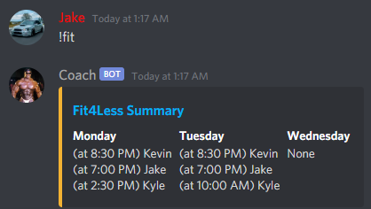

# fit4less-workout-booker
Automatically manage workout bookings.

Add account credentials to `users.ts`.  
See `users.example.ts` for examples.

Use `npm run serve` to compile and launch the app.

Use `npm run start` to just launch the app if it has already been compiled.

Comes with Discord integration, allowing users to see who has booked which workouts, in addition to support for using reactions to let users specify "rest" days.  
If a user specifies a rest day, then they will not be auto-booked by the bot for that day.

